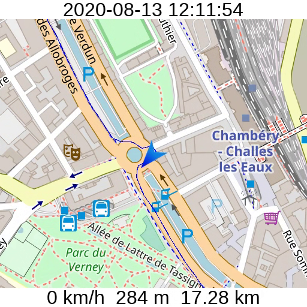

GPS Map Generator
=================

This tool takes a GPX file as input and produces MP4 videos of an animated map augmented with various statistics,
like speed, distance, or elevation. You can then take this video and overlay it on top of your action cam footage using
your favorite video editor.

Here is how the map looks like:

Here is an example of a video that incorporates the generated map:

The video cycles through several maps at different zoom levels, showing a detailed map most of the time as well as
several zoomed out ones in order to give an overview of the trip.

Building
========

Assuming you have an Ubuntu installation, run the following commands:

    $ sudo apt-get update
    $ sudo apt-get install cmake clang libopenimageio-dev libcurl4-openssl-dev libboost-filesystem-dev libavcodec-dev \
        libavformat-dev libswscale-dev libgtest-dev
    $ git clone https://github.com/vitalych/gpsmap
    $ mkdir gpsmap-build && cd gpsmap-build
    $ cmake ../gpsmap
    $ make

How to use
==========

    # If you have a Garmin device, you will have *.fit files instead of *.gpx. Convert them as follows:
    $ gpsbabel -i garmin_fit -f trace.fit -o gpx -F trace.fit.gpx

    # Create a directory that will store the downloaded map tiles from OpenStreetMap
    $ TILESDIR=/path/to/tiles/dir
    $ mkdir -p $TILESDIR

    # Generate the map video
    $ SRCDIR=/path/to/gpsmap/source
    $ BUILDIR=/path/to/gpsmap-build
    $ $BUILDIR/src/gps \
        -gpx /path/to/trace.fit.gpx \
        -rsrcdir $SRCDIR/rsrc \
        -tiles $TILESDIR \
        -outdir /path/to/video/out

The tool splits the GPX file into segments and generates one MP4 video for each of them. A new segment starts when the
speed drops to 0 km/h. This makes it much easier to spot uninteresting parts where you stopped and cut them out in your
video editor.
